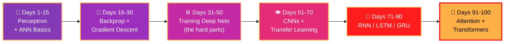

<div align="center">


<br/><br/>


</div>

---

## 🎯 The Mission

> **100 din mein neural networks ko ander se samajhna — perceptron ki pehli line se Transformer ke attention tak.**

Ye folder mera daily Deep Learning log hai. Har concept pehle **theory + math**, phir **from-scratch code**, phir framework implementation. Black box nahi — **glass box learning.** 🔍

---

## 🗺️ The 100-Day Journey



<details open>
<summary><b>🧱 Phase 1 — Perceptron & ANN Foundations</b> &nbsp;</summary>
<br/>

- 🤔 What is Deep Learning? · DL vs ML
- ⚡ **Perceptron** — geometry, perceptron trick, loss function
- 🕸️ Multi-Layer Perceptron (MLP) — architecture & intuition
- ➡️ Forward Propagation step-by-step
- 🎛️ MLP for regression & classification

</details>

<details open>
<summary><b>🔁 Phase 2 — Backpropagation & Gradient Descent</b> &nbsp;</summary>
<br/>

- 🧮 **Backpropagation from scratch** — regression + classification
- ⬇️ Gradient Descent in neural networks
- 📉 Loss functions — MSE, Binary/Categorical Cross-Entropy
- 🧪 Building ANNs in Keras/TensorFlow

</details>

<details>
<summary><b>⚙️ Phase 3 — Training Deep Nets (The Hard Parts)</b> &nbsp;</summary>
<br/>

- 🌊 **Vanishing & Exploding Gradients**
- 🛑 Early Stopping · Data Scaling · Dropout
- 🛡️ Regularization (L1/L2)
- ⚡ Activation functions — ReLU family & beyond
- 🎲 Weight Initialization — Xavier/Glorot, He
- 📦 **Batch Normalization**
- 🚀 Optimizers — Momentum, NAG, AdaGrad, RMSProp, **Adam**
- 🎛️ Hyperparameter tuning with Keras Tuner

</details>

<details>
<summary><b>👁️ Phase 4 — CNNs & Computer Vision</b> &nbsp;</summary>
<br/>

- 🔲 Convolution — filters, padding, strides
- 🏊 Pooling layers · CNN architecture
- 🏛️ Classic architectures — LeNet & beyond
- 🖼️ CNN vs ANN on real image data
- 🎨 **Data Augmentation**
- 🔄 **Transfer Learning** — pretrained models (VGG, ResNet)
- 🎯 Fine-tuning strategies

</details>

<details>
<summary><b>🔄 Phase 5 — Sequence Models</b> &nbsp;</summary>
<br/>

- 🔁 **RNNs** — architecture, forward pass, sentiment analysis
- ⏰ Backpropagation Through Time (BPTT)
- ⚠️ RNN problems — long-term dependencies
- 🧠 **LSTM** — gates & cell state explained
- ⚡ **GRU** — the simpler cousin
- 🏗️ Deep RNNs · Bidirectional RNNs

</details>

<details>
<summary><b>🤖 Phase 6 — Attention & Transformers</b> &nbsp;</summary>
<br/>

- 🔀 Seq2Seq / Encoder-Decoder architecture
- 👀 **Attention mechanism** — why it changed everything
- 🤖 **Transformers** — self-attention, multi-head attention
- 🧩 Positional encoding · Layer normalization
- 🚪 Gateway to LLMs 🚀

</details>

---

## 📂 Folder Structure

```
🧠 Deep Learning in 100 days/
│
├── 📓 Day-wise notebooks    → Concept + from-scratch code + framework version
├── 🧪 experiments/          → Architecture comparisons & ablations
└── 📊 projects/             → Mini-projects per phase (coming soon)
```

---

## 📈 Progress Tracker

| Phase | Topic | Days | Status |
|-------|-------|------|--------|
| 1️⃣ | Perceptron & ANN | 1–15 | 🔄 In Progress |
| 2️⃣ | Backprop & GD | 16–30 | ⏳ Upcoming |
| 3️⃣ | Training Deep Nets | 31–50 | ⏳ Upcoming |
| 4️⃣ | CNNs & Vision | 51–70 | ⏳ Upcoming |
| 5️⃣ | RNN / LSTM / GRU | 71–90 | ⏳ Upcoming |
| 6️⃣ | Attention & Transformers | 91–100 | ⏳ Upcoming |


---

## 🧰 Daily Workflow

```
📖 Learn  →  ✍️ Math on paper  →  💻 Code from scratch  →  🔧 Framework version  →  📤 Push
```

> 💡 **Rule:** Pehle NumPy se khud banao, phir TensorFlow/PyTorch use karo. Tabhi pata chalega andar kya ho raha hai.

---

<div align="center">

## 🤝 Connect

[](https://github.com/dikshantk809-create)
[](mailto:dikshantk809@gmail.com)

<br/>

### ⭐ Neural networks seekhne ka safar — star maar ke saath chalo!

*"Layers of effort, epochs of consistency — that's how deep learning works. Literally."*

**Learning in public — Dikshant** 🚀


</div>
