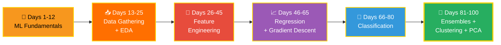

<div align="center">


<br/><br/>


</div>

---

## 🎯 The Mission

> **100 din. Ek promise. Machine Learning — theory se leke production tak.**

Ye folder mera daily ML learning log hai — har concept ke liye hands-on Jupyter notebook. Sirf padhna nahi — **har algorithm ko khud code karna.** 💪

---

## 🗺️ The 100-Day Journey



<details open>
<summary><b>🧱 Phase 1 — ML Fundamentals</b> &nbsp;</summary>
<br/>

- 🤔 What is ML? · AI vs ML vs DL
- 🔀 Types of ML — Supervised, Unsupervised, Reinforcement
- ⚙️ Batch vs Online Learning · Instance vs Model-based
- ⚠️ Challenges in ML · Real-world Applications
- 🔄 ML Development Life Cycle (MLDLC)
- 💼 Data Engineer vs Analyst vs Scientist vs ML Engineer

</details>

<details open>
<summary><b>📥 Phase 2 — Data Gathering + EDA</b> &nbsp;</summary>
<br/>

- 📄 CSV, JSON, SQL se data lana
- 🌐 APIs se DataFrame · Web Scraping
- 🔍 Understanding your data
- 📊 EDA — Univariate, Bivariate & Multivariate analysis
- 🤖 Pandas Profiling

</details>

<details>
<summary><b>🔧 Phase 3 — Feature Engineering</b> &nbsp;</summary>
<br/>

- ⚖️ Standardization & Normalization
- 🏷️ Ordinal + One-Hot Encoding · Column Transformer
- 🔗 **Sklearn Pipelines** (production-style!)
- 🧮 Function & Power Transformers · Binning
- 📅 Date-Time handling · Mixed variables
- 🕳️ Missing data — CCA, Simple/KNN/Iterative Imputer (MICE)
- 📏 Outliers — Z-score, IQR, Percentile
- 🏗️ Feature Construction & Splitting

</details>

<details>
<summary><b>📈 Phase 4 — Regression Deep Dive</b> &nbsp;</summary>
<br/>

- 📉 Simple & Multiple Linear Regression (from scratch!)
- 📐 Regression metrics — MAE, MSE, RMSE, R²
- ⬇️ **Gradient Descent** — Batch, Stochastic, Mini-Batch
- 🌀 Polynomial Regression · Bias-Variance Tradeoff
- 🛡️ Regularization — Ridge, Lasso, ElasticNet

</details>

<details>
<summary><b>🎯 Phase 5 — Classification</b> &nbsp;</summary>
<br/>

- 📊 Logistic Regression · Softmax
- 🎚️ Classification metrics — Precision, Recall, F1, ROC-AUC
- 🌳 Decision Trees — Entropy, Gini, Pruning
- ⚔️ SVM — Kernels & margins
- 🎲 Naive Bayes · 👥 KNN

</details>

<details>
<summary><b>🌲 Phase 6 — Ensembles, Clustering & PCA</b> &nbsp;</summary>
<br/>

- 🗳️ Voting · Bagging · **Random Forest**
- 🚀 Boosting — AdaBoost, Gradient Boosting, **XGBoost**
- 🥞 Stacking
- 🔵 Clustering — KMeans, Agglomerative, DBSCAN
- 📐 Dimensionality Reduction — **PCA**

</details>

---

## 📂 Folder Structure

```
📊 Machine Learning in 100 days/
│
├── 📓 Basic.ipynb          → Foundation concepts notebook
├── 🏗️ end-to-end-ml/       → Complete ML project (data → model → evaluation)
└── 📅 Day-wise notebooks   → Added as the journey continues...
```

---

## 📈 Progress Tracker

| Phase | Topic | Days | Status |
|-------|-------|------|--------|
| 1️⃣ | ML Fundamentals | 1–12 | ✅ Done |
| 2️⃣ | Data Gathering + EDA | 13–25 | 🔄 In Progress |
| 3️⃣ | Feature Engineering | 26–45 | ⏳ Upcoming |
| 4️⃣ | Regression | 46–65 | ⏳ Upcoming |
| 5️⃣ | Classification | 66–80 | ⏳ Upcoming |
| 6️⃣ | Ensembles + Clustering | 81–100 | ⏳ Upcoming |


---

## 🧰 Daily Workflow

```
📖 Learn  →  📝 Notes  →  💻 Code it myself  →  🧪 Experiment  →  📤 Push to GitHub
```

> 💡 **Rule:** Jab tak khud code na karo, concept clear nahi hota. Copy-paste = 0 learning.

---

<div align="center">

## 🤝 Connect

[](https://github.com/dikshantk809-create)
[](mailto:dikshantk809@gmail.com)

<br/>

### ⭐ Journey follow karna hai? Star maar do!

*"Consistency beats intensity — 100 days, no excuses."*

**Learning in public — Dikshant** 🚀


</div>
