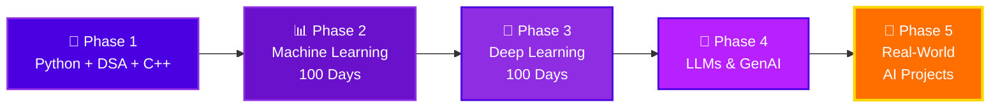

<div align="center">


<br/>


<br/>


</div>

---

## 🎯 Mission

> **"The best way to predict the future is to build it."**

This repository documents my complete **AI learning journey** — from writing my first Python loop to understanding how Large Language Models think. Every commit is a step forward. Every folder is a milestone.

---

## 🗺️ The Master Roadmap



<details open>
<summary><b>🧱 Phase 1 — Programming Foundations</b> &nbsp;</summary>
<br/>

| # | Topic | What's Inside | Folder |
|---|-------|---------------|--------|
| 1 | 🐍 Python Core | Syntax, OOP, file handling, modules | [`Python`](./Python) |
| 2 | 🧩 Python + DSA | Arrays, linked lists, stacks, queues, trees, sorting, searching, recursion | [`Python+dsa`](./Python+dsa) |
| 3 | ⚡ C++ | Fundamentals, STL, problem solving | [`C++`](./C++) |

**🎓 Outcome:** Strong problem-solving base — the foundation every AI engineer needs.

</details>

<details open>
<summary><b>📊 Phase 2 — Machine Learning in 100 Days</b> &nbsp;</summary>
<br/>

📁 [`Machine Learning in 100 days`](./Machine%20Learning%20in%20100%20days)

```
Days 1-20    ▶ Data wrangling: NumPy, Pandas, Matplotlib, Seaborn
Days 21-40   ▶ Preprocessing: cleaning, encoding, scaling, feature engineering
Days 41-60   ▶ Supervised ML: regression, classification, decision trees
Days 61-80   ▶ Ensemble methods: random forest, gradient boosting, XGBoost
Days 81-100  ▶ Unsupervised ML + model tuning: clustering, PCA, cross-validation
```

**🎓 Outcome:** Build, evaluate & tune ML models end-to-end with scikit-learn.

</details>

<details open>
<summary><b>🧠 Phase 3 — Deep Learning in 100 Days</b> &nbsp;</summary>
<br/>

📁 [`Deep Learning in 100 days`](./Deep%20Learning%20in%20100%20days)

```
Days 1-20    ▶ Neural network fundamentals: perceptron, backprop, activations
Days 21-40   ▶ Training deep nets: optimizers, regularization, batch norm
Days 41-60   ▶ Computer Vision: CNNs, transfer learning, image augmentation
Days 61-80   ▶ Sequence models: RNN, LSTM, GRU
Days 81-100  ▶ Attention & Transformers: the bridge to LLMs
```

**🎓 Outcome:** Design & train deep neural networks with TensorFlow / PyTorch.

</details>

<details>
<summary><b>🤖 Phase 4 — LLMs & Generative AI</b> &nbsp;</summary>
<br/>

- 🔮 Transformer architecture from scratch
- 🎛️ Fine-tuning & LoRA
- 💬 Prompt engineering
- 📚 RAG (Retrieval-Augmented Generation)
- 🤗 Hugging Face ecosystem
- 🕵️ AI Agents

</details>

<details>
<summary><b>🚀 Phase 5 — Real-World Projects</b> &nbsp;</summary>
<br/>

- 🏗️ End-to-end ML pipeline with deployment
- 🌐 AI-powered web app
- 🤖 Custom chatbot with RAG
- 📊 Kaggle competitions

</details>

---

## 📂 Repository Structure

```
🤖 AI-Gen/
│
├── 🐍 Python/                        → Python fundamentals & practice
├── 🧩 Python+dsa/                    → Data Structures & Algorithms
├── ⚡ C++/                           → C++ programming
├── 📊 Machine Learning in 100 days/  → Daily ML learning log
├── 🧠 Deep Learning in 100 days/     → Daily DL learning log
└── 📄 Notes & Resources
```

---

## 📈 Progress Tracker

<div align="center">

| Phase | Progress |
|-------|----------|
| 🧱 Foundations |  |
| 📊 Machine Learning |  |
| 🧠 Deep Learning |  |
| 🤖 LLMs & GenAI |  |

</div>

- [x] Repository setup & roadmap defined
- [x] Python fundamentals started
- [x] DSA practice started
- [x] C++ basics started
- [ ] 100 Days of ML — complete
- [ ] 100 Days of DL — complete
- [ ] First end-to-end ML project
- [ ] LLM & Transformers deep dive
- [ ] Deploy an AI application

---

## ⚙️ Quick Start

```bash
# Clone the repo
git clone https://github.com/dikshantk809-create/AI-Gen.git
cd AI-Gen

# Install common dependencies
pip install numpy pandas matplotlib seaborn scikit-learn jupyter

# Launch notebooks
jupyter notebook
```

---

## 📊 GitHub Stats

<div align="center">


</div>

---

## 🤝 Connect With Me

<div align="center">

[](https://github.com/dikshantk809-create)
[](mailto:dikshantk809@gmail.com)

<br/>

### ⭐ Found this journey inspiring? Drop a star — it keeps the momentum going!

*"From code to intelligence — one day at a time."*

**Made with ❤️ & ☕ by Dikshant**


</div>
